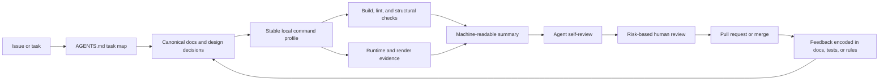

# Harness Engineering Proposal for MapLibre Native

| Field | Value |
| --- | --- |
| Status | Proposal |
| Assessment date | 2026-08-20 |
| Repository baseline | `2e13de25f46d` |
| Source | [Harness engineering: leveraging Codex in an agent-first world](https://openai.com/index/harness-engineering/), OpenAI, 2026-02-11 |

## Executive recommendation

MapLibre Native should adopt the article's harness-engineering principles, but as a staged retrofit for a mature, public, multi-platform native SDK. The project already has much of the expensive foundation: broad CI, unit tests, render golden tests, expression tests, device tests, coverage, static analysis, benchmarks, binary-size reports, code generation, and design proposals.

The missing layer is a coherent control plane around those capabilities. Repository knowledge is fragmented and sometimes stale, local validation has no single stable entry point, architectural expectations are mostly descriptive rather than mechanically enforced, and several useful test outputs are optimized for a human opening an artifact rather than an agent consuming a structured result.

The highest-leverage sequence is:

1. Add a short root `AGENTS.md` that acts as a map, not a manual.
2. Make the maintained developer documentation the explicit system of record and add freshness checks.
3. Provide one discoverable command surface for environment checks, generation, formatting, builds, and tests.
4. Baseline the existing dependency graph, then prevent new architectural violations instead of attempting an immediate relayering.
5. Emit machine-readable test, render, benchmark, and binary-size evidence alongside current human-readable reports.
6. Introduce a small quality ledger and recurring cleanup workflow once the earlier controls are trusted.

MapLibre Native should not copy the article's minimal merge gates or “no manually-written code” constraint. The public API, ABI, GPU/backend matrix, release surface, and community governance make human accountability and risk-based blocking checks essential.

## Scope and method

This assessment reviewed the tracked repository at the baseline commit above, including:

- Root architecture, contribution, security, build, and package configuration.
- The core C++ public and private trees under `include/mbgl` and `src/mbgl`.
- Android, Apple, Linux, Windows, Qt, Node.js, and Rust integration points.
- Unit, expression, render, device, benchmark, and fixture infrastructure.
- CMake, Bazel, Gradle/Make, npm/pnpm, and Rust task entry points.
- All 31 GitHub Actions workflow files, path filters, reusable actions, and validation scripts.
- The mdBook, Doxygen, platform documentation, and accepted design proposals.
- Formatting, linting, code generation, coverage, performance, and binary-size checks.

Repository facts below refer to tracked files. Untracked local artifacts and local-only submodule state were excluded.

The inventory is large enough that agent legibility matters:

| Measure | Current baseline |
| --- | ---: |
| Tracked files | 15,698 |
| Code-like files | 3,054 |
| Files in test and benchmark trees | 991 |
| Markdown files | 158 |
| GitHub Actions workflow files | 31 |
| Largest core areas | `style`, `renderer`, `util`, shaders, and graphics backends |

The proposal intentionally focuses on the development harness. It does not propose a rendering architecture rewrite, a build-system migration, or a new product API.

## What the article means for this repository

The article's transferable lesson is that agent performance is primarily an environment-design problem. Agents need a small map, repository-local truth, executable constraints, direct access to runtime evidence, and short feedback loops. Failures should be treated as missing capabilities or missing constraints that can be encoded for the next run.

| Article principle | MapLibre Native interpretation | Recommendation |
| --- | --- | --- |
| Give agents a map, not a large manual | The repository spans several platforms, build systems, and documentation trees | Add a concise root map with task-specific routes |
| Keep knowledge in the repository | Important knowledge exists, but it is distributed and some of it is outdated | Declare canonical sources, index them, and check freshness |
| Make the application directly legible | Render reports, images, logs, benchmarks, and device artifacts exist | Add structured summaries and reproducible bundles |
| Enforce invariants rather than implementations | Formatting and static analysis are strong; architectural boundaries are not explicit | Add baseline-aware structural checks with actionable errors |
| Use the same tools humans use | CI commands are capable but scattered across workflow YAML and platform guides | Wrap existing tools in a thin, stable command surface |
| Feed failures back into the harness | Flakes, stale instructions, and architectural drift are handled case by case | Add ledgers and recurring small cleanup jobs |
| Increase autonomy only after feedback loops exist | The repository has strong tests but uneven local reproducibility and advisory checks | Gate autonomy by risk and demonstrated reliability |

## Current-state assessment

### Strong foundations to preserve

#### Broad executable feedback

The repository already validates more than a typical agent-oriented project:

- Core C++ unit, expression, and render tests are built and run on several operating systems and rendering backends.
- Android and iOS have build, unit, render, device, and release workflows.
- Linux and Windows run CodeQL; Linux also produces coverage through Bazel.
- Pull requests can receive benchmark and binary-size comparisons.
- Render tests retain visual baselines, actual images, diffs, metrics, and an HTML report.
- CMake exposes address, thread, and undefined-behavior sanitizer modes.
- `clang-tidy` is configured with warnings as errors for the enabled checks.
- Pre-commit covers whitespace, file validity, ClangFormat, Buildifier, Actionlint, SwiftFormat, and Rust formatting.
- Generated Android code is regenerated and the worktree is checked for drift in Android CI.

These are exactly the kinds of feedback loops the article recommends. The proposal should unify and expose them rather than replace them.

#### Existing repository-local knowledge

There is already a useful documentation base:

- [The mdBook](mdbook/src/SUMMARY.md) covers platforms, rendering tests, design, profiling, and Rust.
- [Design proposals](../design-proposals/) provide a community process for substantial decisions.
- [CMake presets](../CMakePresets.json) encode supported renderer and platform configurations.
- Platform-specific developer guides live near their implementations.
- [The release policy](mdbook/src/release-policy.md), platform release guides, and [security policy](../SECURITY.md) capture important operational knowledge.

The needed change is clearer ownership and navigation, not wholesale replacement.

#### Mature visual and performance test assets

MapLibre Native is unusually well positioned for agent-verifiable graphics changes. The render-test runner already produces an HTML result, image differences, expected and actual JSON, and performance/resource metrics. Google Benchmark and Bloaty are integrated into pull-request workflows. This can become a powerful agent feedback surface with relatively small output-format additions.

### Gaps that limit reliable agent work

#### 1. There is no repository map for an agent or new contributor

No root `AGENTS.md` exists. A task currently begins with broad search across root documents, the mdBook, platform guides, workflow YAML, and build files. The repository has many capable commands, but no short routing document answers questions such as:

- Which source of truth applies to a core, renderer, backend, or platform change?
- Which files are generated, and what exact command regenerates them?
- What is the smallest relevant local check, and what is the CI-equivalent check?
- Which render baselines may be updated, under what evidence, and which require human judgment?
- Which platform checks are expected when shared C++ changes?

This increases context use and makes locally plausible but incomplete validation likely.

#### 2. Canonical documentation is ambiguous and demonstrably stale

[The top-level architecture guide](../ARCHITECTURE.md) describes a root Makefile, gyp, Mason, and an OpenGL-centered architecture. There is no tracked root Makefile, current core builds are centered on CMake and Bazel, and the current CMake options include OpenGL, Vulkan, Metal, and WebGPU.

[The mdBook design introduction](mdbook/src/design/README.md) says it documents the state at the end of 2022 and warns that parts are outdated. The ten-thousand-foot view still describes OpenGL as the shared renderer choice. Meanwhile, active build and CI files were changed in 2026.

There are smaller signs of instruction drift:

- [The contribution guide](../CONTRIBUTING.md) names `.pre-commit-config.yml`; the tracked file is `.pre-commit-config.yaml`.
- Generated style files instruct contributors to run `make style-code` and edit `.js` generators, while the current root generator is `.mjs` and no root Makefile is tracked.
- `scripts/nitpick/generated-code.js` references generator paths that are no longer present and is not part of the current general validation workflow.

For an agent, stale procedural text is worse than missing text because it looks authoritative.

#### 3. Validation is powerful but fragmented

The authoritative commands are embedded in several places:

- CMake and Bazel targets for core tests.
- Platform-specific Gradle and Make targets.
- A Rust `justfile`.
- Node and TypeScript scripts.
- GitHub Actions workflow steps and custom actions.
- Platform documentation with partially different setup instructions.

There is no repository-wide `doctor`, `list-checks`, `check-changed`, or structured summary command. An agent must reconstruct the correct sequence, environment, filters, and artifact paths for every task.

This fragmentation also makes CI/local parity difficult to verify. A local command may pass while omitting generated-code freshness, the correct backend, or a platform wrapper affected by a core API change.

#### 4. Architecture is described, but dependency invariants are not enforced

The core source tree has understandable domain directories, but direct include relationships are densely connected. A simple top-level include scan shows many reciprocal relationships among `renderer`, `style`, `tile`, `gfx`, `map`, `text`, `layout`, `util`, and backend areas. There are also explicit backend includes outside backend directories for bridge and custom-layer behavior.

This means the article's clean forward-only layer model cannot be imposed directly. It also means documentation alone will not stop new cycles or backend leakage. The repository needs a checked, project-specific rule set that acknowledges the current graph and tightens it incrementally.

#### 5. Important evidence is not consistently machine-readable

The render-test runner's durable aggregate is an HTML report. CI uploads that report on failure, while expected/actual JSON and images are distributed under individual fixture paths. Benchmarks and Bloaty produce useful text comments. GoogleTest supports structured output, but the main workflow invokes the binary without standardizing a retained JSON or JUnit result.

Humans can inspect these artifacts. An agent can do so too, but it must scrape console output or HTML and infer where related evidence lives. A stable summary schema would reduce that work and make multi-hour autonomous loops safer.

#### 6. Flakes and non-blocking checks are not centrally explained

Several workflow jobs use `continue-on-error`, including Vulkan unit tests and Node render-related checks. Some uses are intentional infrastructure behavior, while at least one is explicitly marked flaky. Sanitizer support exists, but the iOS sanitizer block is commented out.

There is no central flake/quarantine register that records the owner, scope, rationale, linked issue, retry policy, and expiry. An agent therefore cannot reliably distinguish accepted platform debt from an accidental weakening of a gate.

#### 7. Entropy is visible but not managed as a first-class loop

The repository has TODOs, old generator instructions, partially outdated architecture documents, commented test configurations, and a large set of cross-domain relationships. There is no checked-in quality score, explicit debt ledger, or scheduled documentation/architecture gardening workflow.

Renovate, Dependabot, pre-commit, CodeQL, and code coverage address portions of maintenance, but they do not form an integrated “garbage collection” loop for repository knowledge and structural consistency.

## Proposed target operating model

The target is not “an agent can change anything.” The target is “an agent can discover the relevant rules, reproduce the current behavior, make a bounded change, produce reviewable evidence, and escalate the decisions that require maintainer judgment.”



The same command profiles and evidence formats should be used by contributors, agents, and CI. Agent-only paths would create a second development environment and eventually drift.

## Workstream 1: A small repository map and a canonical knowledge system

### 1.1 Add a root `AGENTS.md`

Target 80–120 lines. It should be a routing table, not a compressed copy of all developer documentation.

Recommended contents:

1. Repository purpose and non-negotiable compatibility constraints.
2. A task-to-document map for core C++, rendering backends, Android, Apple, Node, Qt, Rust, docs, releases, and security.
3. A task-to-validation-profile map.
4. Generated-file rules and the canonical regeneration command.
5. Rules for render baseline changes and test suppression changes.
6. A pointer to the AI contribution policy and the requirement for human verification and disclosure.
7. A short “when to escalate” list: public API/ABI changes, release signing, baseline acceptance, security, licensing, and broad architecture changes.

It should not contain compiler installation guides, command transcripts, architecture essays, or copied CI YAML.

### 1.2 Define where each kind of truth lives

Use the existing structures instead of creating a parallel wiki:

```text
AGENTS.md                         # short map and operating rules
ARCHITECTURE.md                   # short current overview and canonical links
docs/mdbook/src/engineering/      # maintained developer system of record
design-proposals/                 # accepted non-trivial decisions
docs/exec-plans/active/           # multi-PR implementation plans
docs/exec-plans/completed/        # retained decision and progress history
docs/generated/                   # generated inventories; never hand-edited
```

Recommended engineering documents:

- `engineering/build-and-checks.md`: profiles, prerequisites, local/CI parity, artifact locations.
- `engineering/architecture.md`: current domains, public/private boundaries, backend seams, and known exceptions.
- `engineering/generated-code.md`: source specifications, generators, outputs, and exact refresh commands.
- `engineering/testing.md`: unit, expression, render, platform, device, sanitizer, performance, and size tests.
- `engineering/reliability.md`: flakes, quarantines, retries, timeouts, and observability conventions.
- `engineering/security.md`: secure development checks and escalation routes, linked to the public security policy.

The root architecture document should either become a short current map to these pages or be regenerated from the canonical architecture data. Two independently maintained architecture descriptions should not survive.

### 1.3 Add lightweight documentation contracts

For maintained engineering pages, require small metadata fields:

- Status: current, provisional, historical, or superseded.
- Scope: directories, targets, or platforms covered.
- Maintainer domain rather than a named individual where possible.
- Last verified commit.
- Related design proposals and executable checks.

CI should validate:

- Internal links and mdBook `SUMMARY.md` reachability.
- That referenced local paths and named scripts exist.
- That command snippets marked as verified still match a registered command profile.
- That historical or superseded pages are visibly labeled.
- That generated documentation has not been hand-edited.

Freshness should not be a blanket age limit. Stable conceptual documents can remain valid for years. A page should become suspect when covered paths or commands change after its verified commit.

### Acceptance criteria

- A new contributor or agent can route every major task class from `AGENTS.md` without broad repository search.
- Every procedural command in the root map resolves to the stable command surface in Workstream 2.
- The current renderer/backend and build-system descriptions match CMake, Bazel, and CI.
- Stale generator instructions are removed or redirected to one canonical page.
- Documentation-only pull requests exercise link, structure, and command-reference checks.

## Workstream 2: One stable command surface over existing tools

### 2.1 Add a thin cross-platform dispatcher

Use the repository's existing Node/TypeScript toolchain for a small dispatcher rather than introducing a new task framework. Node is already used for code generation and CI utilities, and the TypeScript scripts already have a validation workflow.

An illustrative interface is:

```text
node scripts/dev.mjs doctor
node scripts/dev.mjs list
node scripts/dev.mjs generate --check
node scripts/dev.mjs check --profile core-linux-fast --changed --format json
node scripts/dev.mjs check --profile docs --format json
node scripts/dev.mjs check --profile android --format json
node scripts/dev.mjs repro render --manifest <path> --filter <test>
```

The dispatcher should orchestrate existing CMake, Bazel, Gradle, Make, Rust, pre-commit, and test-runner commands. It should not reimplement their logic.

Required properties:

- `list` explains profiles, supported hosts, expected duration class, prerequisites, and produced artifacts.
- `doctor` reports missing tools, submodules, unsupported host/profile combinations, disk requirements, and optional accelerators such as compiler caches.
- `--changed` selects checks conservatively from versioned path rules and prints why each profile was selected.
- `--format json` emits a versioned summary even when a child command fails.
- Commands are non-interactive and return stable exit codes.
- CI invokes the same profiles or a strict superset; it does not maintain a second hidden recipe.
- Each profile records exact child commands, versions, commit, renderer, and environment facts in its summary.

### 2.2 Start with a deliberately small profile set

| Profile | Purpose | Initial contents |
| --- | --- | --- |
| `repo-fast` | Cheap checks for every change | generator freshness, formatting of changed files, build-file formatting, workflow validation, script typecheck/tests, docs contracts |
| `core-linux-fast` | Default core feedback | CMake configure, relevant core build, unit tests, expression tests, filtered render tests |
| `core-linux-full` | CI parity for shared C++ | supported Linux renderer matrix, full unit/expression/render suite, ClangTidy, coverage metadata |
| `docs` | Documentation-only changes | link/structure checks and mdBook build |
| `android` | Android wrapper and native integration | current Android lint, unit, generation, native library, and documentation tasks |
| `apple` | iOS/macOS changes on supported hosts | Bazel/CMake build, unit, render, and selected app/simulator checks |
| `node`, `qt`, `rust`, `windows` | Platform-specific changes | wrappers around current workflow-equivalent commands |

Profiles should compose. A shared C++ change can select `repo-fast`, `core-linux-fast`, and advisory platform profiles without one enormous all-platform command.

### 2.3 Isolate concurrent work

The dispatcher should derive output directories from a stable worktree identifier and profile, for example `build/agent/<worktree-id>/<profile>/`, while respecting build-tool conventions. It should allocate temporary ports and caches explicitly and record them in the summary.

This prevents two agent or human worktrees from corrupting each other's CMake state, generated artifacts, logs, or runtime services. Shared read-only download/compiler caches are desirable; mutable build outputs are not.

### Acceptance criteria

- The map points to one command for each documented check.
- CI and local runs identify the same underlying profile and child commands.
- Failed profiles retain a summary that identifies the first failing stage and all artifact paths.
- Two worktrees can run the same supported profile concurrently without sharing mutable build output.
- Adding a new profile requires documentation, a host capability declaration, and a smoke test.

## Workstream 3: Mechanical architecture and repository invariants

### 3.1 Capture the current dependency graph before enforcing a target

Generate a top-level include graph from C++ sources and public headers, and store a human-readable rendering under `docs/generated/`. Keep the actual rules in a small versioned data file such as `tools/architecture-rules.yaml`.

The first check should be baseline-aware:

1. Record existing edges and approved bridge exceptions.
2. Fail on a new forbidden edge or a new reciprocal relationship.
3. Allow a pull request to remove baseline exceptions without updating a snapshot manually.
4. Require a design-proposal link and maintainer approval to add an exception.

This turns the current graph into a ratchet rather than blocking all work on historic coupling.

### 3.2 Begin with high-value, explainable invariants

Recommended first rules:

- Public headers under `include/mbgl` must not depend on private `src` paths.
- Renderer-independent code must not gain a direct dependency on a concrete GL, Metal, Vulkan, or WebGPU implementation except through named bridge files.
- One backend must not depend directly on another backend.
- Generated outputs may only change with their declared input specification or generator.
- Every generated output has one declared generator and every generator has a freshness check.
- New core source files must be registered consistently in the build systems that own the relevant target.
- Test-only utilities must not enter production targets.
- Platform wrappers must not expose private core implementation headers as public API.

Do not begin with file-size or universal naming limits. Those are useful only after the team agrees they reflect MapLibre Native's design rather than an imported taste preference.

### 3.3 Make lint failures teach the repair

Every custom invariant error should include:

- The violated rule and why it exists.
- The source and target edge or file classification.
- The preferred seam or adapter.
- A link to the canonical architecture page.
- The exceptional-change process when no compliant design exists.

This makes the lint message itself part of the agent's context and reduces repeated failed attempts.

### Acceptance criteria

- The generated dependency view is reproducible and never hand-maintained.
- Existing coupling is baselined; normal pull requests are not blocked by unrelated historic debt.
- CI blocks new forbidden backend and public/private edges.
- Exception additions are rare, explicit, linked to a decision, and separately reviewable.
- The exception count trends down or remains flat over a release cycle.

## Workstream 4: Make tests, rendering, and runtime behavior agent-legible

### 4.1 Define a common result envelope

Every command profile should write a versioned `summary.json` containing:

- Repository commit and dirty-state flag.
- Host, compiler/toolchain, target platform, architecture, renderer, and profile.
- Started/finished timestamps and stage durations.
- Child commands and exit status.
- Test totals, failures, skips, retries, and quarantined failures.
- Paths to logs, JUnit/JSON results, images, diffs, HTML reports, traces, benchmark data, and binary-size data.
- A concise remediation hint for setup failures.

The envelope should link to native tool output rather than flattening all details into a custom format.

### 4.2 Extend existing tools with structured output

Priorities:

1. Invoke GoogleTest with retained JSON or JUnit output in local profiles and CI.
2. Add a JSON aggregate option to the render-test runner while retaining its HTML report and per-fixture evidence.
3. Emit expression-test results in a structured format with fixture identifiers and diffs.
4. Preserve Google Benchmark JSON and Bloaty machine-readable data before rendering pull-request comments.
5. Emit selected-profile reasoning from changed-path logic.

For render failures, one summary record should connect the style fixture, expected image, actual image, diff image, expected/actual JSON, renderer, GPU/device facts where available, and HTML detail page.

### 4.3 Standardize reproducible bug bundles

Add a `repro` command that creates a small manifest for a reported bug:

- Commit and platform/SDK version.
- OS, architecture, device/GPU, and renderer.
- Minimal style/fixture or a safe reference to it.
- Deterministic test filter and seed where applicable.
- Logs and action-journal events.
- Expected and actual behavior.
- Screenshots or recordings when relevant.
- Required credentials represented only as secret names, never values.

Issue templates should request the same fields. A maintainer or agent should be able to turn an accepted bundle into a durable regression fixture with minimal transcription.

### 4.4 Expose existing observability consistently

MapLibre Native already has action-journal documentation, rendering statistics, render metrics, and optional Tracy instrumentation. Define which profile captures which evidence and where it is stored. Prefer bounded, deterministic recordings over a large always-on local observability stack.

For native applications, a practical progression is:

1. Headless core/render runner evidence.
2. Simulator/emulator app launch and action-journal capture.
3. Screenshot or short recording before and after a visual fix.
4. Device-lab validation for issues dependent on real GPUs or OS behavior.

### Acceptance criteria

- Every blocking CI test suite publishes a structured result, including on failure.
- A failed render test can be understood from one summary without scraping workflow logs.
- Bug bundles are deterministic where the underlying platform permits it.
- Logs and bundles are sanitized by default and do not retain credentials or user data.

## Workstream 5: Risk-based review and merge behavior

The article's minimal blocking gates are not appropriate as a blanket rule here. Corrections are not always cheap after a mobile SDK or native binary is released, and failures may appear only on a backend, GPU family, architecture, or downstream wrapper.

Use three gate classes:

| Gate class | Examples | Policy |
| --- | --- | --- |
| Blocking | format/generation drift, compilation, relevant unit/expression/render tests, new architecture violations, public API checks | Must pass before merge unless a maintainer records an explicit exception |
| Advisory with budget | benchmark changes, binary size, coverage delta, known flaky platform jobs | Report structured deltas; become blocking after noise and thresholds are proven |
| Human judgment | public API/ABI design, render baseline acceptance, security, licensing, release signing, new dependency, test suppression | Agent prepares evidence; accountable maintainer decides |

### 5.1 Add a review contract

A pull-request template should require:

- User-visible goal and acceptance criteria.
- Affected domains/platforms/backends.
- Selected validation profiles and links to summaries.
- Render or performance evidence when applicable.
- Public API, compatibility, generated-code, security, and documentation impact.
- AI-assistance disclosure consistent with the MapLibre policy.
- Explicit unchecked items with rationale.

Agents may perform local self-review and respond to review comments, but should not mark human-judgment items complete on their own.

### 5.2 Introduce autonomy by category

Recommended progression:

1. Agent prepares a change and evidence; human authors/reviews the pull request.
2. Agent handles deterministic review feedback and CI repairs; human approves and merges.
3. Low-risk cleanup pull requests may receive automated review after a measured pilot.
4. Automerge is considered only for narrow, reversible categories such as verified generated refreshes or dependency updates with full green profiles.

Do not use pull-request throughput or lines of code as success measures. Optimize for time-to-reproduce, first-pass validation, escaped defects, review attention, and debt reduction.

## Workstream 6: Continuous entropy management

### 6.1 Add a small quality ledger

Create a versioned ledger by domain and platform. It should summarize evidence, not assign a subjective beauty score.

Suggested dimensions:

- Canonical architecture documentation status.
- Local/CI profile availability and parity.
- Unit, expression, render, integration, and device coverage.
- Supported renderer/backend coverage.
- Machine-readable evidence availability.
- Active flakes/quarantines.
- Architecture-rule exception count.
- Generated-code freshness coverage.
- Performance and binary-size budget status.
- Known high-priority debt with issue links.

Store raw measurements in a small data file and generate the Markdown view. Avoid a manually edited score that immediately drifts.

### 6.2 Establish recurring, bounded gardening jobs

Start in report-only mode:

- Documentation links, path references, and stale command detection.
- Architecture baseline and exception changes.
- Generated-file provenance and freshness.
- Flake/quarantine expiry.
- Disabled or `continue-on-error` checks without a current issue and expiry.
- Dependency/security advisory status.
- Orphan source/test files not owned by an expected build target.
- Duplicate small helpers and obsolete compatibility paths, reviewed conservatively.

After the reports are trusted, open small targeted pull requests. Do not combine unrelated cleanup into large autonomous refactors. Do not auto-delete code or rebaseline render results.

### 6.3 Treat repeated agent failures as harness backlog

When an agent fails for a reason that is likely to recur, capture one of:

- A missing route in `AGENTS.md`.
- A missing or stale engineering document.
- A new `doctor` diagnostic.
- A stable command profile or fixture.
- A custom lint with remediation.
- A structured artifact field.
- A design proposal when the missing seam is architectural.

This is the compounding loop the article describes. Prompt wording should be the last resort for repository-wide rules.

## Delivery plan

Because this changes contributor workflow and repository governance, implementation should begin with a MapLibre design proposal derived from this document and follow the process in [CONTRIBUTING.md](../CONTRIBUTING.md).

### Phase 0: Agree on the contract

| ID | Deliverable | Acceptance signal | Effort |
| --- | --- | --- | --- |
| H0 | Community design proposal | Scope, canonical doc locations, pilot host/profile, and authority boundaries accepted | M |
| H1 | Baseline measurements | Time-to-first-check, CI duration, current architecture edges/exceptions, flakes, and artifact formats recorded | S |

### Phase 1: Make the repository navigable

| ID | Deliverable | Acceptance signal | Effort |
| --- | --- | --- | --- |
| H2 | Root `AGENTS.md` map | Major task classes route to current docs and checks | S |
| H3 | Current architecture/build docs | OpenGL/Vulkan/Metal/WebGPU and CMake/Bazel/platform responsibilities are accurate | M |
| H4 | Generated-code registry | Every generated family names current inputs, generator, outputs, and check command | M |
| H5 | Documentation contracts | Broken paths/links and stale command references fail a docs profile | M |

### Phase 2: Unify the feedback entry point

| ID | Deliverable | Acceptance signal | Effort |
| --- | --- | --- | --- |
| H6 | Dispatcher with `doctor` and `list` | Supported profiles and missing prerequisites are discoverable without reading workflow YAML | M |
| H7 | `repo-fast`, `docs`, and `core-linux-fast` | Local and CI runs use the same profile definitions | L |
| H8 | Structured result envelope | Failure summary is always written and points to native artifacts | M |

Linux core is the recommended pilot because it already exercises CMake, Bazel coverage, ClangTidy, unit tests, expression tests, render tests, benchmarks, Bloaty, and CodeQL without requiring a mobile host. Apple and Android profiles should follow after the schema and dispatcher prove stable.

### Phase 3: Ratchet architecture and reliability

| ID | Deliverable | Acceptance signal | Effort |
| --- | --- | --- | --- |
| H9 | Generated dependency graph and baseline | Current graph is reproducible and reviewable | M |
| H10 | First structural invariants | New public/private and backend violations block with actionable messages | L |
| H11 | Flake/quarantine register | Every non-blocking test has an issue, owner domain, rationale, policy, and expiry | S |
| H12 | Generated/build parity checks | New source or generated files cannot silently miss an owning build target | L |

### Phase 4: Improve runtime evidence

| ID | Deliverable | Acceptance signal | Effort |
| --- | --- | --- | --- |
| H13 | Structured unit/expression/render output | CI publishes parseable suite and fixture results | L |
| H14 | Reproduction bundles | One command packages a core/render reproduction safely | M |
| H15 | Simulator/emulator evidence pilot | One supported app flow produces logs plus before/after screenshots or recordings | L |

### Phase 5: Add continuous garbage collection

| ID | Deliverable | Acceptance signal | Effort |
| --- | --- | --- | --- |
| H16 | Generated quality ledger | Domain/platform status updates from repository evidence | M |
| H17 | Scheduled report-only gardening | Reports are low-noise for one release cycle | M |
| H18 | Targeted cleanup pull requests | Small, reviewable fixes are opened; no automatic rebaseline or deletion | M |
| H19 | Limited automerge experiment | Only an explicitly approved low-risk category is eligible | M |

Effort is relative: S is one focused pull request, M is several related changes, and L is a multi-PR effort or cross-platform coordination.

## Pilot design

Run the first pilot on three real changes rather than a synthetic benchmark:

1. Correct a stale generated-code instruction and prove the freshness check detects recurrence.
2. Fix a small shared C++ bug with a deterministic unit or expression fixture.
3. Fix a render regression and produce a structured bundle linking expected, actual, diff, metrics, and HTML evidence.

For each task, compare the pre-harness and pilot experience where possible:

- Time from checkout to a valid first relevant check.
- Time to reproduce the failure.
- Number of incorrect or missing validation attempts.
- First-pass CI success rate.
- Human minutes needed to locate and review evidence.
- Whether review feedback becomes a reusable rule, test, or document.

The pilot succeeds when the harness reduces ambiguity without adding disproportionate setup time or CI cost. It should not be judged on code volume or agent PR throughput.

## Suggested success measures

| Measure | Desired direction | Why it matters |
| --- | --- | --- |
| Time to first relevant local check | Down | Measures discoverability and setup quality |
| Time to deterministic reproduction | Down | Measures fixture and runtime legibility |
| First-pass CI success for locally validated changes | Up | Measures local/CI parity |
| Pull requests with complete structured evidence | Up | Reduces human log archaeology |
| New architecture exceptions | Zero or rare | Prevents structural drift |
| Existing architecture exceptions | Flat, then down | Ratchets debt without a freeze |
| Flaky/non-blocking checks without current issue and expiry | Down to zero | Makes gate semantics trustworthy |
| Stale command/path references | Down to zero | Protects repository knowledge |
| Escaped platform/backend regressions | Down | Validates the actual engineering outcome |
| Human review time on mechanical issues | Down | Preserves judgment for API, rendering, and product decisions |

Set numeric targets only after Phase 0 records a baseline. Arbitrary targets would encourage optimizing the metric rather than the system.

## Risks and mitigations

| Risk | Likely failure mode | Mitigation |
| --- | --- | --- |
| A second documentation hierarchy | New `docs/engineering` pages duplicate mdBook or platform guides | Use mdBook as the maintained developer source; root pages remain maps |
| Command wrapper becomes another build system | Logic is copied from CMake/Gradle/workflows | Keep the dispatcher thin, log child commands, and test CI parity |
| Structural checks freeze legacy architecture | Existing cycles block unrelated work | Baseline current edges and fail only on new violations initially |
| Path-based check selection misses impact | A shared change skips a platform | Default conservatively; show selection reasons; retain full protected-branch matrix |
| More artifacts overwhelm reviewers | Every job uploads unindexed logs | Use one summary envelope with links and retention rules |
| Flakes are normalized instead of fixed | Registry becomes a permanent exemption list | Require issues, owners, retry policy, and expiry; report overdue entries |
| Agent-generated cleanup creates churn | Large low-value refactors consume review capacity | Begin report-only; cap scope; one rule and one domain per pull request |
| Captured repro data leaks secrets or user content | Logs or bundles retain credentials/data | Redact by default, reference secret names, and require review for uploads |
| OSS governance is bypassed | Automation speaks or merges without accountable review | Preserve AI disclosure, human authorship/accountability, and design-proposal rules |
| CI cost grows | Every change runs every platform and backend | Layer fast/local, affected, advisory, and protected-branch profiles with measured budgets |

## Practices not recommended for direct adoption

### Do not adopt “zero manually-written code” as policy

That constraint was useful to OpenAI's experiment, but it is not a quality or governance requirement for MapLibre Native. Contributors remain responsible for understanding, verifying, and representing their changes.

### Do not weaken the merge gates globally

The cost of a correction after a native SDK release is materially different from the cost inside a fast-moving internal web product. Existing multi-platform correctness gates should remain blocking unless a measured, explicit policy says otherwise.

### Do not impose a generic forward-only layer model

MapLibre Native's renderer, style, tile, graphics abstraction, and platform backends have historic reciprocal relationships. The useful principle is mechanical boundaries, not the article's exact domain-layer sequence.

### Do not replace established tools to make the harness look uniform

CMake, Bazel, Gradle, platform Make targets, GoogleTest, Google Benchmark, mdBook, and existing workflow actions encode valuable behavior. Uniformity should come from a discoverable dispatcher and common evidence schema.

### Do not make every advisory signal immediately blocking

Performance, binary-size, coverage, and flaky device signals need stable baselines and understood noise before becoming hard gates. Report first, budget second, block last.

### Do not build one enormous instruction file

The root map should remain short. Detailed knowledge belongs near the relevant code and in canonical, linked engineering pages whose claims can be checked.

## Decisions required before implementation

1. Confirm that the mdBook is the canonical maintained developer-documentation system, with root documents serving as maps.
2. Select the Linux core profile as the first dispatcher and structured-output pilot, or nominate a different pilot.
3. Agree on the first architectural invariants and who may approve new exceptions.
4. Define which current `continue-on-error` cases are intentional, flaky, or obsolete.
5. Agree on artifact retention and redaction requirements for logs, images, traces, and repro bundles.
6. Define the low-risk categories, if any, that may eventually qualify for automated review or merge.

## Final recommendation

Proceed with Phases 0–2 before investing in autonomous pull-request loops. MapLibre Native already has enough testing depth to benefit quickly from a better map, current documentation, a stable local command surface, and structured evidence. Those changes should reduce contributor friction immediately, even if no autonomous agent is used.

Once those foundations are reliable, add architecture ratchets and recurring cleanup. Autonomy should be the consequence of trustworthy repository feedback, not the starting assumption.
